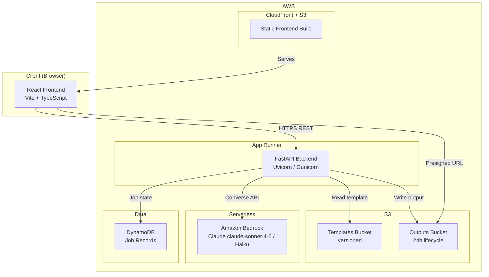
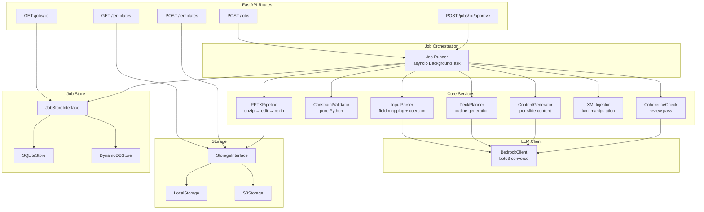
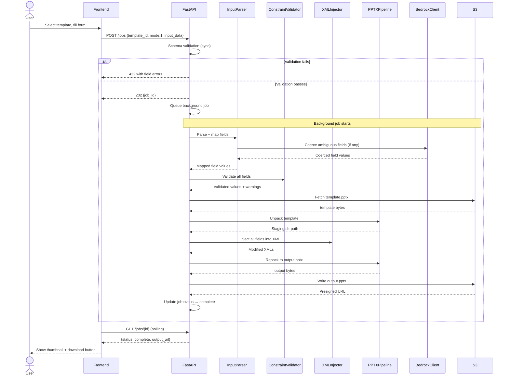
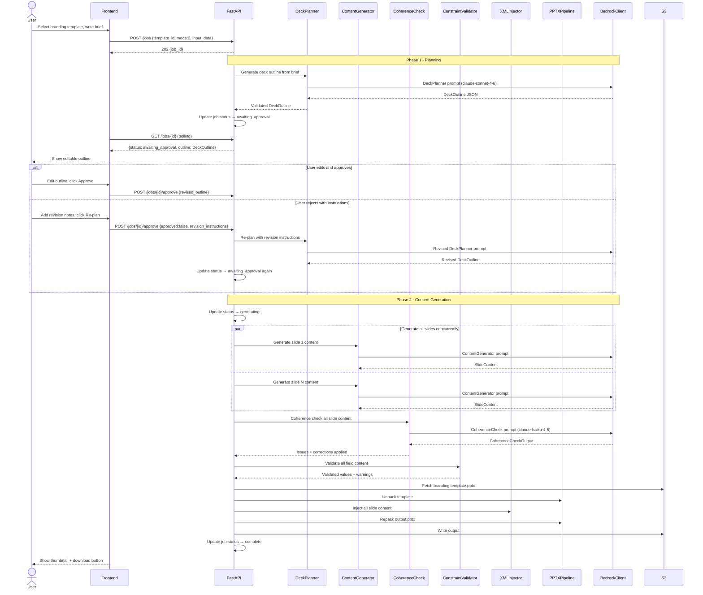
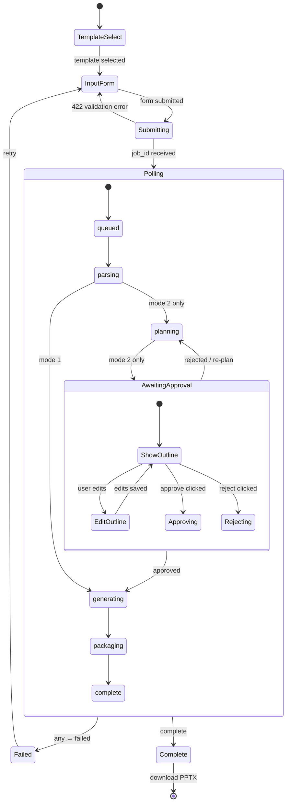

# SlideAgent — Architecture Diagrams

## System Architecture



---

## Backend Service Architecture



---

## Mode 1: Template Population Flow



---

## Mode 2: Branded Content Generation Flow



---

## PPTX Pipeline Detail

```mermaid
flowchart TD
    A[template.pptx from S3/disk] --> B[Unzip to staging_dir/job_id/]
    B --> C[Parse presentation.xml<br/>Build slide index map]
    C --> D{For each InjectionTarget}
    D --> E[Open slide{N}.xml with lxml]
    E --> F[XPath to shape by shape_id]
    F --> G{Shape found?}
    G -->|No| H[Log warning: shape_id missing<br/>Continue]
    G -->|Yes| I[Find all a:t elements in shape]
    I --> J[Replace text content<br/>Preserve a:rPr attributes]
    J --> K[Validate XML well-formed]
    K --> L{Valid?}
    L -->|No| M[Fail job<br/>Preserve staging dir]
    L -->|Yes| N[Write modified slide{N}.xml]
    N --> D
    D -->|All slides done| O[Run clean pass<br/>Remove orphaned rels]
    O --> P[Rezip to output.pptx<br/>Preserve original theme/media]
    P --> Q[Verify output opens<br/>No XML parse errors]
    Q --> R[Upload to S3<br/>Generate presigned URL]
    R --> S[Cleanup staging dir]
    S --> T[Return PipelineResult]
```

---

## Frontend State Machine


